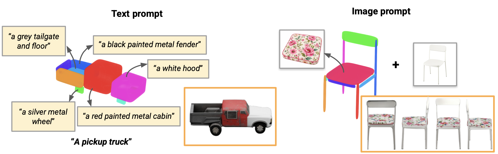

<h1 align="center">MultiGen: Superquadric-Aware Latent Control for 3D Object Generation </h1>

<p align="center">
  
</p>

**MultiGen** is a training-free, test-time method that gives [TRELLIS](https://github.com/microsoft/TRELLIS) **part-level appearance control**. A user authors a coarse layout as a small set of superquadric (SQ) primitives, attaches one text prompt to each part, and MultiGen generates a textured 3D asset whose appearance is *part-local* — each region carries the color and material of its own prompt — while geometry stays globally coherent.

TRELLIS conditions every voxel on one global prompt, so compositional descriptions smear attributes across the whole object. MultiGen moves control into the SLAT denoising stage, where this attribute binding is decided.

## Installation

Tested on **CUDA 12.8**, NVIDIA 4090, `torch 2.8.0+cu128`.

1. Clone this repository
```sh
# Clone this repository
git clone https://github.com/xandaaaa/MultiGen.git
cd Multigen
```

2. Install the dependencies
```sh
# Check your CUDA toolkit
nvcc --version

# Create the environment
conda create -n multigen python=3.10 -y
conda activate multigen

# PyTorch (see https://pytorch.org/get-started/locally/ for your setup)
pip install torch==2.8.0 torchvision==0.23.0 torchaudio==2.8.0 \
    --index-url https://download.pytorch.org/whl/cu128

# Core Python dependencies
pip install pillow imageio imageio-ffmpeg tqdm easydict opencv-python-headless \
    scipy ninja rembg onnxruntime trimesh open3d xatlas pyvista pymeshfix igraph \
    transformers psutil viser tensorboard pandas lpips
pip install git+https://github.com/EasternJournalist/utils3d.git@9a4eb15e4021b67b12c460c7057d642626897ec8

# Attention + sparse kernels
pip install xformers==0.0.32.post1 --index-url https://download.pytorch.org/whl/cu128
pip install flash-attn --no-build-isolation
pip install kaolin -f https://nvidia-kaolin.s3.us-east-2.amazonaws.com/torch-2.8.0_cu128.html
pip install spconv-cu120

# Rendering extensions
mkdir -p /tmp/extensions

git clone https://github.com/NVlabs/nvdiffrast.git /tmp/extensions/nvdiffrast
pip install /tmp/extensions/nvdiffrast --no-build-isolation

git clone --recurse-submodules https://github.com/JeffreyXiang/diffoctreerast.git /tmp/extensions/diffoctreerast
pip install /tmp/extensions/diffoctreerast --no-build-isolation

git clone https://github.com/autonomousvision/mip-splatting.git /tmp/extensions/mip-splatting
pip install /tmp/extensions/mip-splatting/submodules/diff-gaussian-rasterization/ --no-build-isolation

cp -r extensions/vox2seq /tmp/extensions/vox2seq
pip install /tmp/extensions/vox2seq --no-build-isolation
```

Sanity check the CUDA + sparse-conv install:

```sh
python -c "import torch; print(torch.cuda.is_available()); import spconv; print('spconv OK')"
```

## Running MultiGen

There are two ways to run MultiGen: an **interactive GUI** for authoring a single asset, and a **batch runner** for reproducing the benchmark. Both load the TRELLIS weights from `gui/` and expect a GPU. Run every command from the repository root.

### Interactive GUI

The [viser](https://viser.studio)-based editor lets you author a superquadric layout, type one prompt for any superquadric, and generate the asset with MultiGen in the loop.

```sh
# From the repo root
python gui/gui_text_image.py
# then open http://localhost:8080
```

On a remote/cluster machine, forward the viser port first:

```sh
ssh -L 8080:localhost:8080 $USER@<host>     # on your laptop
python gui/gui_text_image.py                # on the host
```

In the browser: pick a template from the dropdown (loaded from `gui/superquadrics/*_sq.npz`), edit the superquadrics, type a **Region Prompt (MultiGen)** per part, set the control slider, and click **Generate MultiGen**.

## Benchmark dataset

To evaluate MultiGen under a consistent input distribution, we built a **20-shape superquadric benchmark** under [superdec/data/dataset_20/](superdec/data/dataset_20/). Each shape is a per-object `.npz`.

**Curation.** From the ShapeNet subset SuperDec was trained on, we take 10 categories (airplane, bench, cabinet, car, chair, lamp, rifle, sofa, table, watercraft) × 8 candidates, run SuperDec to fit superquadrics, and hand-pick the 2 most distinct shapes per category. Scripts and setup notes are in [superdec/SETUP.md](superdec/SETUP.md).

**Editing & annotation.** SuperDec fits are imperfect, so [superdec/scripts/sq_editor.py](superdec/scripts/sq_editor.py) is a standalone [viser](https://viser.studio) editor (no GPU) for hand-correcting the `.npz`. Each shape then gets a per-SQ prompt file under [superdec/data/dataset_20/previews/](superdec/data/dataset_20/previews/) (`<category>_<model_id>_annotation.txt`), with a global description plus one line per superquadric (`SQ0: Left wing`, …).

## Evaluation: comparative VLM ranking

We evaluate MultiGen against the geometry-matched `spacecontrol` baseline across 100 comparisons with a **comparative VLM ranking** in [benchmark/vqa_rank.py](benchmark/vqa_rank.py). For each `(shape, prompt)` pair, the four rendered views (front / right / back / left) of each method are shown side by side to a VLM, which ranks the two outputs across **five criteria**:

- **Prompt Fidelity** — do colors/materials match the prompt's specification?
- **Structure Clarity** — does the texturing preserve recognizable part geometry?
- **Detail Quality** — are local textures clean, sharp, and artifact-free?
- **Part Assignment** — is the right appearance on the right part (no swapped/merged colors)?
- **Overall Quality** — the holistic preference.

### Results
<details>
<summary>Evaluation results</summary>
<br>

| Method | avg_rank ↓ | overall_win ↑ |
|---|---|---|
| **MultiGen** | **1.45** | **0.59** |
| SpaceControl | 1.49 | 0.41 |

Per-criterion wins (ties not shown) tell the sharper story:

| Criterion | MultiGen wins | SpaceControl wins |
|---|---|---|
| **Prompt Fidelity** | **65** | 33 |
| **Part Assignment** | **62** | 26 |
| **Overall Quality** | **59** | 41 |
| Structure Clarity | 36 | 54 |
| Detail Quality | 24 | 71 |

MultiGen wins **decisively on the binding-aware criteria** (Prompt Fidelity, Part Assignment) and on the **Overall** preference, exactly where global text conditioning fails. 
</details>

### Running the benchmark

We provide our renders and results in `results/` however feel free to rerun the benchmark as below:

The full pipeline is two stages: **render**, then **score**.  

**1. Generate renders.**  `benchmark/run_benchmark.py` runs one approach over one or all shapes and writes views to `<results_root>/<approach>_results/renders/<shape_id>/prompt_<i>/view_<j>.png`. We compare MultiGen with Spacecontrol:

```bash
python benchmark/run_benchmark.py --approach multigen     --shape-idx all
python benchmark/run_benchmark.py --approach spacecontrol --shape-idx all
```

Useful flags: `--shape-idx <n>` to render a single shape; `--steps` (default 25) and `--force` to re-render existing views. Default prompts file is `benchmark/prompts_augmented.json`.

**2. VLM ranking.** Set `OPENAI_API_KEY="YOUR_API_KEY"` in terminal (or pass `--api-key`) and run:

```bash
python benchmark/vqa_rank.py \
    --benchmark benchmark/prompts_augmented.json \
    --results-root results \
    --approaches multigen spacecontrol \
    --output results/vqa_ranking.json
```

Useful flags: `--shape-id <id>` to rank a single shape; `--vlm-model <name>` to change grader (default `gpt-5-mini`). It prints a per criterion breakdown and writes the full per-comparison records to `--output`.

## Contributors

- **Xander Yap** — [xanyap@student.ethz.ch](mailto:xanyap@student.ethz.ch)
- **Allison Tsz Kwan Lau** — [alllau@student.ethz.ch](mailto:alllau@student.ethz.ch)
- **Zhijing Liu** — [liuzhij@student.ethz.ch](mailto:liuzhij@student.ethz.ch)

## Acknowledgements

We are grateful to our supervisors **Elisabetta Fedele**, **Sayan Deb Sarkar**, and **Ata Çelen** for their guidance and support throughout the project. We also build on [TRELLIS](https://github.com/microsoft/TRELLIS), [SpaceControl](https://github.com/spacecontrol3d/spacecontrol) and [SuperDec](https://github.com/elisabettafedele/superdec), whose work made this project possible.